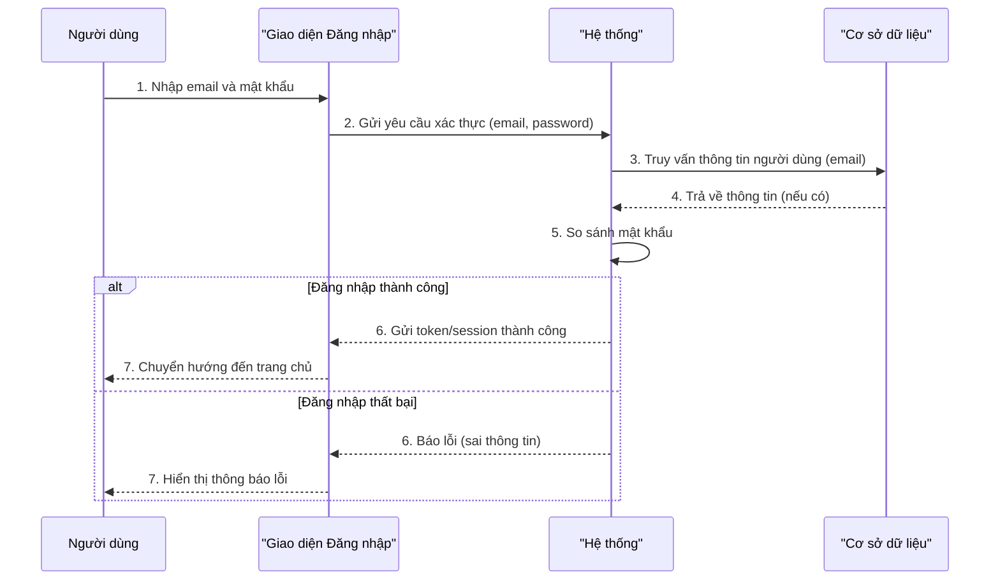
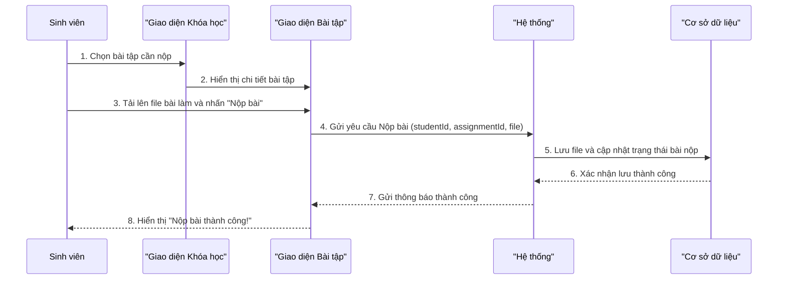
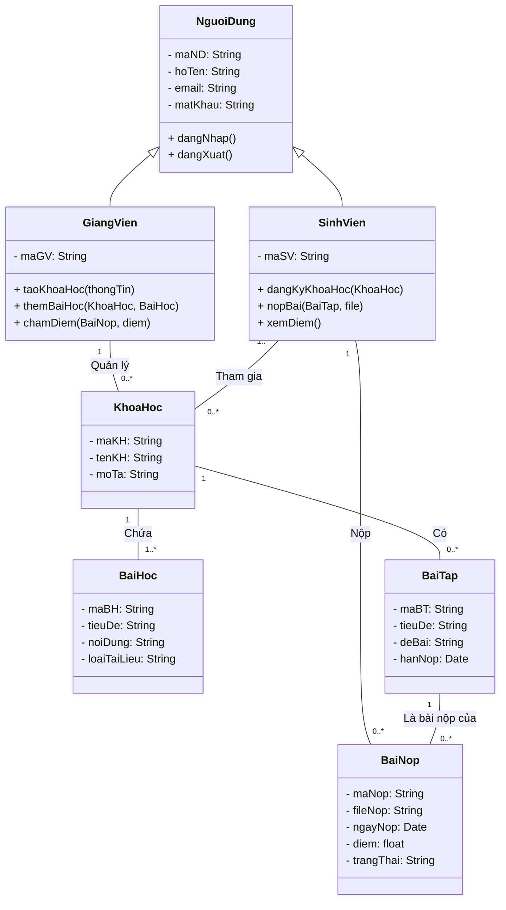
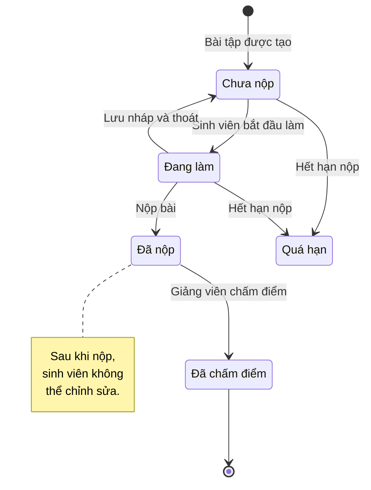

# Báo cáo: Thiết kế Sơ đồ UML cho Mini App E-Learning

## Thông tin sinh viên

- **Họ và tên:** `Nguyễn Văn A`
- **Mã số sinh viên:** `XXXXXXXX`
- **Lớp:** `IT-XXXX`

---

## Giới thiệu Đề tài

Dự án này tập trung vào việc phân tích và thiết kế hệ thống cho một "Mini App E-Learning", một ứng dụng hỗ trợ học tập trực tuyến dành cho sinh viên và giảng viên. Tài liệu này trình bày các sơ đồ UML cốt lõi để mô tả kiến trúc và hành vi của hệ thống, bao gồm: Sơ đồ Use Case, Sơ đồ Tuần tự, Sơ đồ Lớp và Sơ đồ Trạng thái.

---

### **Câu 1: Sơ đồ Use Case (UC) & Sơ đồ Tuần tự (SQ)**

#### **1.1. Sơ đồ Use Case (Use Case Diagram)**

Sơ đồ Use Case mô tả các chức năng chính của hệ thống từ góc nhìn của người dùng (actors).

- **Tác nhân (Actors):**
  - **Sinh viên:** Người học, tham gia khóa học.
  - **Giảng viên:** Người dạy, quản lý khóa học.

- **Sơ đồ (Đã sửa lỗi dòng trống):**
```mermaid
graph TD
    %% Khai báo Actors (Tác nhân) cho đúng chuẩn hình người
    actor SV as "Sinh viên"
    actor GV as "Giảng viên"

    %% System boundary (Ranh giới hệ thống)
    subgraph "Hệ thống Mini App E-Learning"
        %% Khai báo Use Cases cho đúng chuẩn hình oval
        UC1("Đăng nhập / Đăng ký")
        UC2("Xem danh sách khóa học")
        UC3("Đăng ký khóa học")
        UC4("Học bài")
        UC5("Làm bài tập / Thi")
        UC6("Xem điểm")
        UC7("Quản lý khóa học")
        UC8("Tải lên tài liệu")
        UC9("Tạo bài tập / Thi")
        UC10("Chấm điểm")
        UC11("Tham gia thảo luận")
    end

    %% Associations (Liên kết giữa Actor và Use Case)
    SV --> UC1
    SV --> UC2
    SV --> UC3
    SV --> UC4
    SV --> UC5
    SV --> UC6
    SV --> UC11

    GV --> UC1
    GV --> UC7
    GV --> UC8
    GV --> UC9
    GV --> UC10
    GV --> UC11

    %% <<include>> relationships (Quan hệ bao gồm)
    %% Một Use Case bắt buộc phải gọi một Use Case khác
    UC3 ..> UC1 : <<include>>
    UC4 ..> UC1 : <<include>>
    UC5 ..> UC1 : <<include>>
    UC7 ..> UC1 : <<include>>
```

#### **1.2. Sơ đồ Tuần tự (Sequence Diagram)**

Mô tả luồng tương tác giữa các đối tượng để thực hiện một Use Case cụ thể.

**a. Luồng chức năng "Đăng nhập"**


**b. Luồng chức năng "Sinh viên nộp bài tập"**


---

### **Câu 2: Sơ đồ Lớp (Class Diagram)**

Sơ đồ lớp mô tả cấu trúc tĩnh của hệ thống, bao gồm các lớp, thuộc tính, phương thức và mối quan hệ giữa chúng.



---

### **Câu 3: Sơ đồ Trạng thái (State Diagram)**

Sơ đồ trạng thái mô tả các trạng thái của một đối tượng trong vòng đời của nó. Dưới đây là sơ đồ trạng thái cho đối tượng **"Bài nộp" (`BaiNop`)**.


